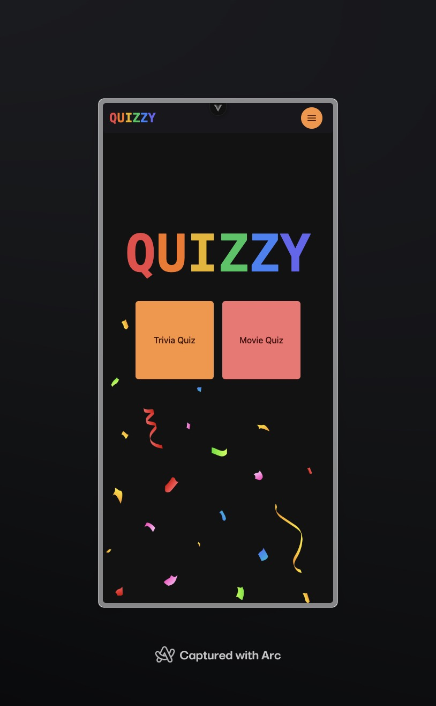
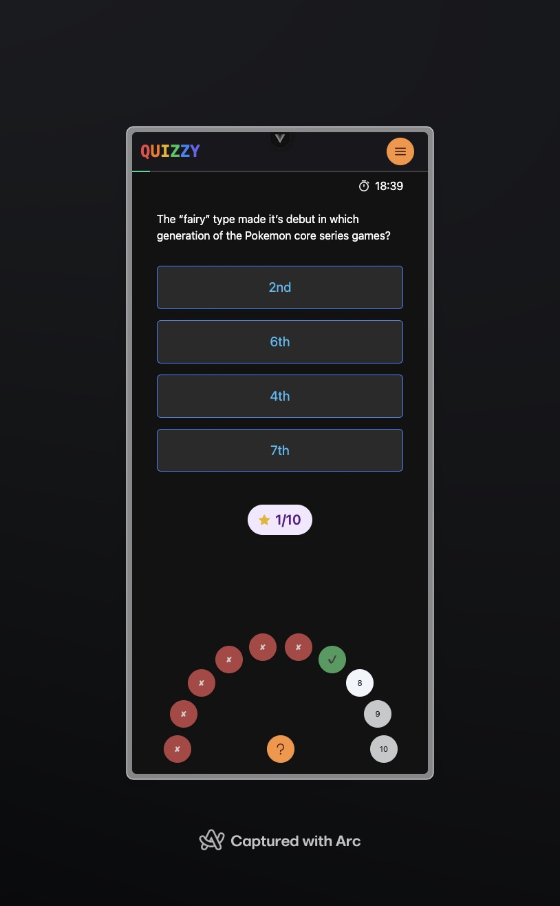
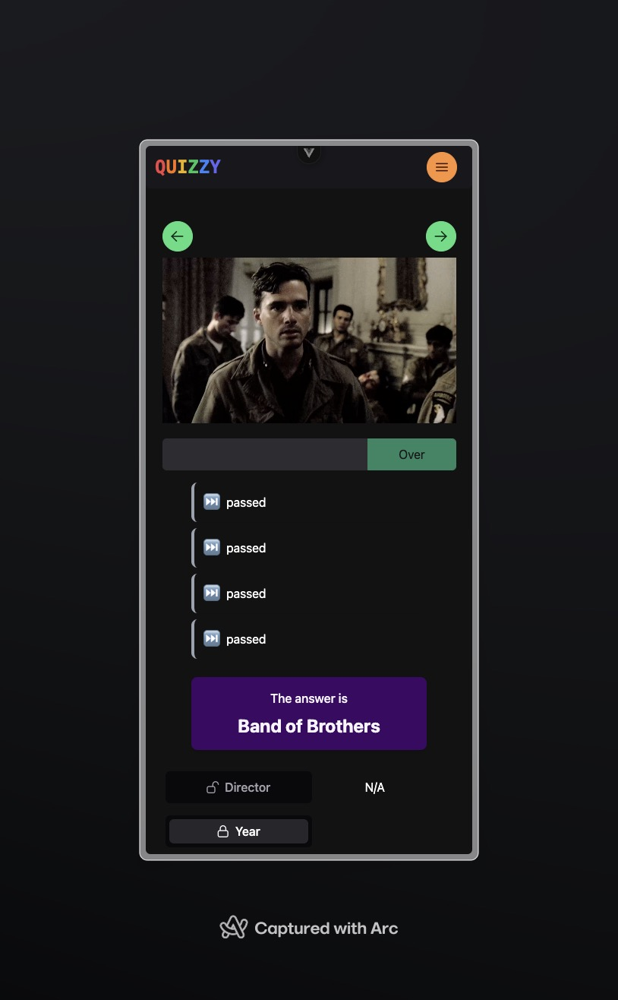

# Movie Quiz Game 🎬

A dynamic and interactive movie trivia game built with Vue 3 and Vite, featuring timed trivia and movie quizzes with a modern UI components powered by PrimeVue.

## Features ✨

- **Flash Game Mode**: Quick-paced trivia questions with countdown timer
- **Beautiful UI**: Modern interface with animations and confetti effects
- **Customizable Settings**: Adjust game duration and number of questions
- **Progress Tracking**: Real-time score tracking and progress indicators
- **Responsive Design**: Works seamlessly on both desktop and mobile devices

## Tech Stack 🛠️

- Vue 3 with Composition API
- Vite for fast development and building
- TailwindCSS for styling
- PrimeVue for UI components
- Vue Router for navigation
- Vue Query for data fetching
- Axios for API requests






## Getting Started 🚀

### Prerequisites

- Node.js (Latest LTS version recommended)
- npm or yarn package manager
- Clipcafe API key (Get it from Clipcafe)

### Installation

1. Clone the repository
```bash
git clone https://github.com/efesezen1/v-movie-quiz.git
cd v-movie-quiz
```

2. Set up environment variables
- Copy `.env.example` to `.env`
- Add your Clipcafe API key to the `.env` file:
```bash
VITE_APP_API_KEY=your_clipcafe_api_key_here
```

3. Install dependencies
```bash
npm install
# or
yarn install
```

4. Start the development server
```bash
npm run dev
# or
yarn dev
```

5. Build for production
```bash
npm run build
# or
yarn build
```

## Project Structure 📁

- `/src` - Source code
  - `/pages` - Main page components (Trivia, Movie)
  - `/components` - Reusable Vue components
  - `/assets` - Static assets
  - `/router` - Vue Router configuration

## Contributing 🤝

Contributions, issues, and feature requests are welcome! Feel free to check the issues page.

## License 📝

This project is licensed under the MIT License - see the LICENSE file for details.
